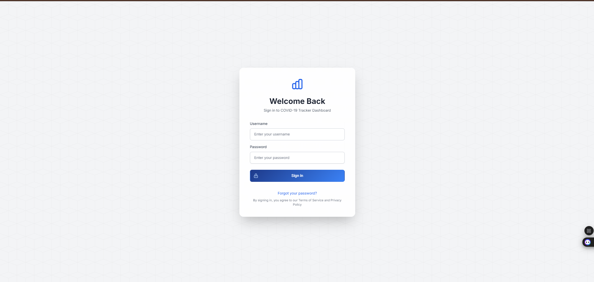
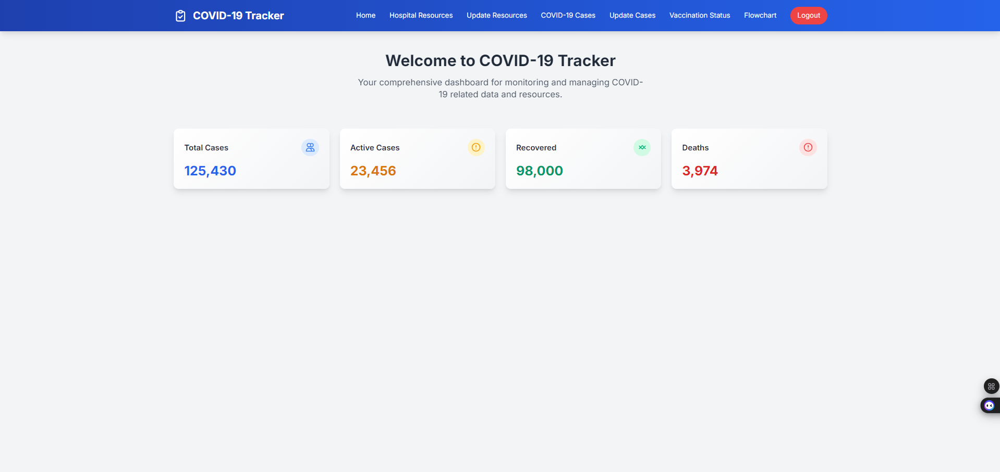
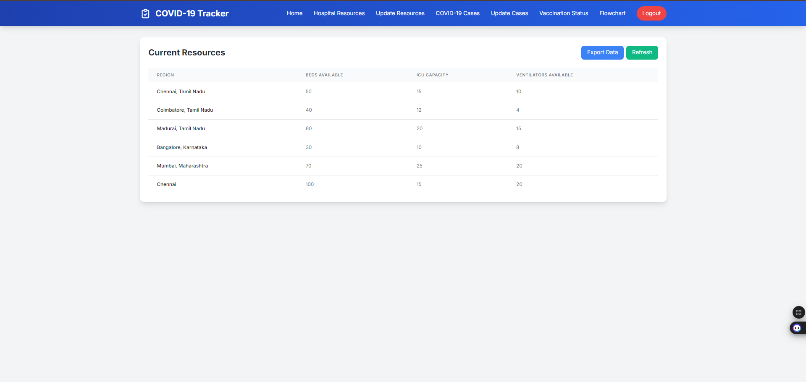
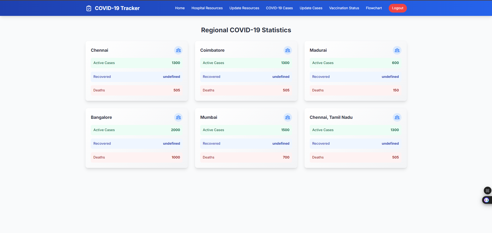
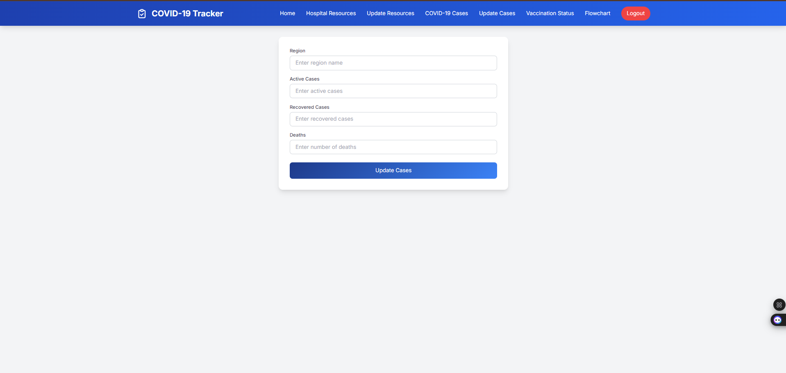
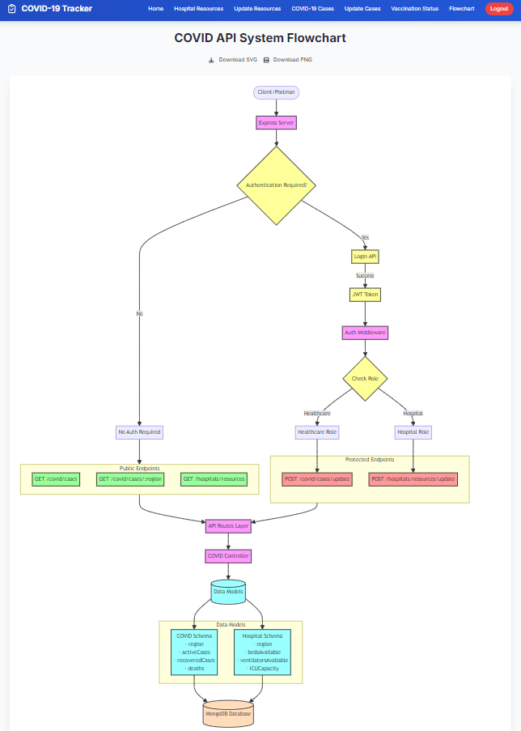

# COVID-19 Tracker: Hospital Resources, Cases, and Vaccination Status


## 📊 Project Overview

This comprehensive COVID-19 Tracker and Information System provides a user-friendly interface for monitoring and managing hospital resources, COVID-19 case data, and vaccination status. It features both a **frontend** (HTML, CSS, JavaScript) and a **backend** (Node.js, Express, MongoDB), allowing users to view real-time hospital resources, update hospital information, and track vaccination progress across various regions.

## 🌟 Key Features

- 🏥 **Hospital Resources:** Real-time view of available beds, ICU beds, ventilators, and oxygen cylinders
- 🦠 **COVID-19 Cases:** Monitor and update case numbers by region
- 💉 **Vaccination Status:** Track vaccination progress across different areas
- 🔐 **Authentication:** Secure login system with token-based authentication
- 📱 **Responsive Design:** Fully adaptive layout for all devices
- 🔀 **Flowchart:** Visual representation of the app workflow

## 📚 Table of Contents

1. [Project Setup](#-project-setup)
2. [Usage Guide](#-usage-guide)
3. [Screenshots](#-screenshots)
4. [Technologies Used](#-technologies-used)
5. [Contributing](#-contributing)
6. [License](#-license)
7. [Acknowledgements](#-acknowledgements)

## 🛠 Project Setup

### Frontend Setup

1. **Clone the repository:**

   ```bash
   git clone https://github.com/your-username/covid-19-tracker.git
   cd covid-19-tracker/frontend
2. **Install dependencies:**

Make sure you have Node.js and npm installed. Then, install the required dependencies:

```bash
npm install
```

3. **Run the Frontend:**

Start the frontend development server:

```bash
npm start
```

The app will be accessible at http://localhost:3000 by default.

4. **Update API Endpoints:**

In the frontend folder, go to index.js (or any other relevant JS file) and make sure the API URL is correct.

```javascript
const response = await fetch('http://127.0.0.1:5000/api/covid/hospitals/resources');
```

Replace http://127.0.0.1:5000 with your backend API URL if deployed remotely.

## Backend Setup

### Navigate to backend directory:
```bash
cd covid-19-tracker/backend
```

### Install Dependencies:

Ensure you have Node.js and npm installed. Then, install the necessary dependencies:

1. **Install Dependencies:**

```bash
npm install
```

2. **Set Up MongoDB:**

Make sure you have MongoDB installed and running locally, or use MongoDB Atlas for a cloud-based database.

3. **Local MongoDB:**

```bash
mongod
```

### Cloud MongoDB (MongoDB Atlas):

Create a MongoDB Atlas account.
Create a new cluster and get the connection string.
Update server.js with your connection string.

### Run the Backend:

Start the backend server:

```bash
node server.js
```

The backend will be accessible at http://localhost:5000 by default.

## Usage

### Login:

Upon visiting the app, users will be prompted to log in. The login functionality uses JWT (JSON Web Tokens) for authentication.

### View Hospital Resources:

After logging in, users can view a table of hospital resources, including beds, ICU beds, ventilators, and oxygen cylinders.

### Update Resources:

Admins can update the hospital resources by filling out a form and submitting new values.

### View COVID-19 Cases:

Users can see the total number of COVID-19 cases for a particular region.

### Vaccination Status:

Users can view the vaccination progress by region and update vaccination statuses.

### Logout:

Click the "Logout" button in the navigation menu to end the session.

## Screenshots
Login Page


Home Page
  <!-- Make sure to update this path if it was incorrect -->

Hospital Resources Page


Update Hospital Resources


COVID-19 Cases Page


Vaccination Status Page


Flowchart Page





## Technologies Used

Frontend:

* HTML
* CSS
* JavaScript
* Fetch API

Backend:

* Node.js
* Express.js
* MongoDB
* Mongoose

Other Tools:

* JWT (JSON Web Tokens) for authentication
* Postman for API testing
* Git for version control

## Contributing

We welcome contributions to this project! If you'd like to contribute, please follow these steps:

Fork the repository
Create a new branch (git checkout -b feature-name)
Commit your changes (git commit -am 'Add new feature')
Push to the branch (git push origin feature-name)
Create a new Pull Request

## License

This project is licensed under the MIT License - see the LICENSE file for details.

## Acknowledgements

Thanks to the COVID-19 Data API for providing the COVID-19 data used in this project.
A big thank you to all the contributors and open-source libraries used in this project.
